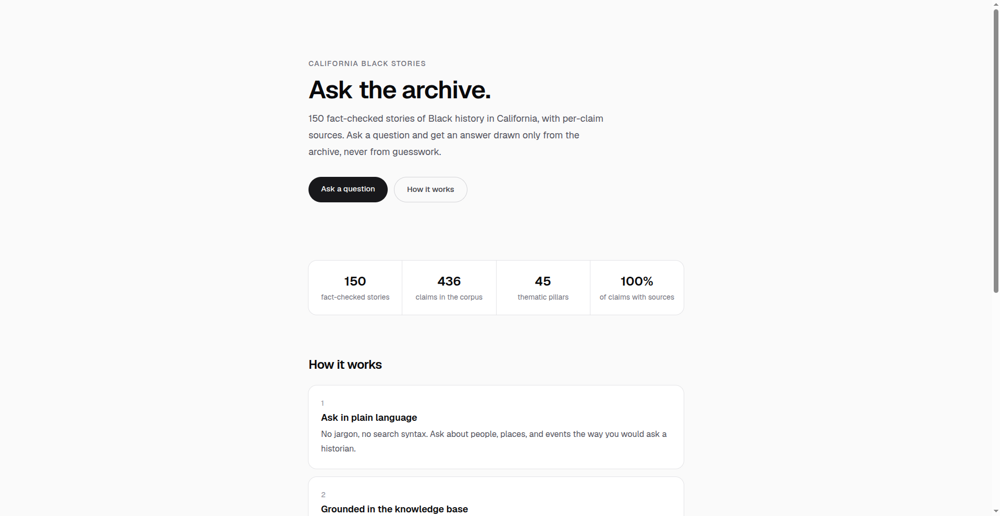

# Ask California Black Stories

A chat agent that answers questions about Black history in California, grounded in a real research archive. Every answer cites its sources. If the archive does not cover your question, the agent says so and stops.

Live: https://ask-california-black-stories.vercel.app/



Built for the [Sanity Challenge](https://dev.to/challenges/sanity-2026-09-16), Path One: Ship an Agent That Queries Real Content.

## The archive

California Black Stories is my content project on Black history in California. The Sanity dataset holds 150 story documents: 436 fact-check claims across 45 thematic pillars, with every claim carrying at least one source URL.

Content model: `story`, `person`, `place`, `source`. Stories carry structured claim objects; people and places are their own documents so questions about who and where resolve against structure, not keyword matching.

## How it works

1. Research notes (an Obsidian vault with three note formats) are parsed into normalized records (`ingest/parse_notes.py`), converted to NDJSON (`ingest/to_ndjson.py`), and imported with `sanity dataset import`.
2. A Sanity Context knowledge base is built on the query `*[_type == "story"]` and exposed through a Context MCP endpoint.
3. The Next.js app (`web/`) serves a chat UI at `/ask`. The `/api/ask` route uses AI SDK v7 with an MCP client pointed at the Sanity Context endpoint. The model answers only from the knowledge base.
4. A story lookup tool hands the agent the real source URLs from the story documents, so citations link to actual sources. Knowledge base entries cite story titles but carry no URLs, and without the tool the model invented plausible-looking links. That bug was caught in testing and fixed before launch.

Grounding rules enforced in the system prompt: answer only from the knowledge base, cite every claim with a real source URL, surface disagreements side by side instead of picking one, and refuse then stop when the archive does not cover the question.

## Repo layout

- `studio/` — Sanity Studio: schema types for `story`, `person`, `place`, `source`
- `web/` — Next.js frontend: landing page, `/ask` chat UI, `/api/ask` route
- `ingest/` — vault note parser and NDJSON converter
- `samples/` — sample notes used to develop the parser
- `CHALLENGE.md` — the original challenge-entry plan

## Local development

You need a Sanity project with the schemas deployed and content imported, a Sanity Context knowledge base with an MCP endpoint, and an OpenAI API key.

In `web/`, copy `.env.example` to `.env.local` and fill in:

```env
NEXT_PUBLIC_SANITY_PROJECT_ID=
NEXT_PUBLIC_SANITY_DATASET=
SANITY_CONTEXT_MCP_URL=
SANITY_CONTEXT_TOKEN=
OPENAI_API_KEY=
OPENAI_MODEL=gpt-4o-mini
```

Then run `npm install` and `npm run dev` in `studio/` and `web/` separately.

`/api/ask` is rate limited to 20 requests per hour per IP. The limiter is in-memory, so treat it as protection against casual abuse, not a hard cap. Set a spending limit in your OpenAI dashboard.

## A note on accuracy

The archive was verified mechanically: all 479 citation markers resolve to real story titles, no two stories cover the same person or event, and the corpus report confirms every claim has at least one source URL. That is structural and citation-level verification, not a line-by-line re-fact-check of all 436 claims. The agent is designed to stay inside what the archive supports and say so when it cannot.
